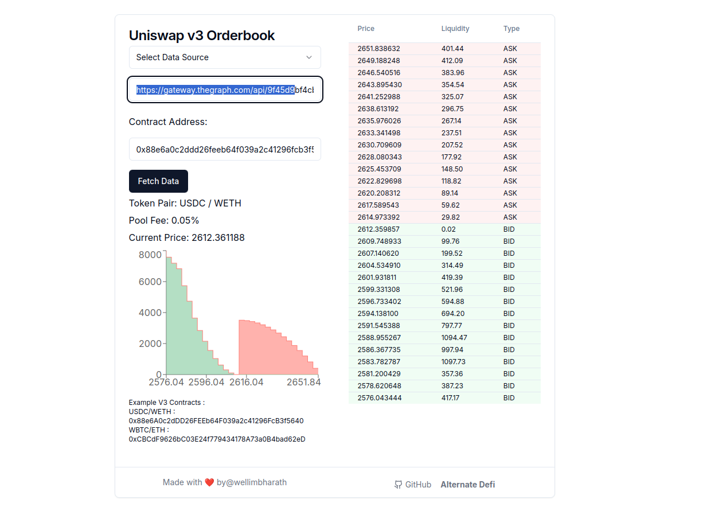

# Alternate defi

Orderbook view of amms with rpc or subgraph across chains.

# How to setup

## Prerequisites

Before you begin, make sure you have Node.js (version 10.13 or later) and npm/yarn installed on your machine.

1. **Node.js**: [Download & Install Node.js](https://nodejs.org/en/download/)
2. **npm** comes with Node.js, but you can ensure it's updated by running `npm install npm@latest -g`.
3. **Yarn** (Optional): [Install Yarn](https://yarnpkg.com/getting-started/install) (if you prefer using Yarn over npm).

- ### Install

1. `git clone git@github.com:wellimbharath/alternate-defi.git`
2. `npm install`
3. `npm run dev`

- ### How to use

1. Get your subgraph from [Uniswap V3 Subgraph](https://thegraph.com/explorer/subgraphs/5zvR82QoaXYFyDEKLZ9t6v9adgnptxYpKpSbxtgVENFV?view=Query&chain=arbitrum-one)
2. Get your api key from [The graph studio](https://thegraph.com/studio/)

Add the `api-key` and `uniswap v3` liquidity pool to the site and visualize the orderbook:

